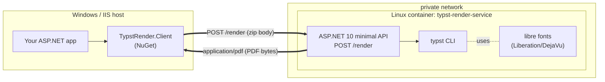
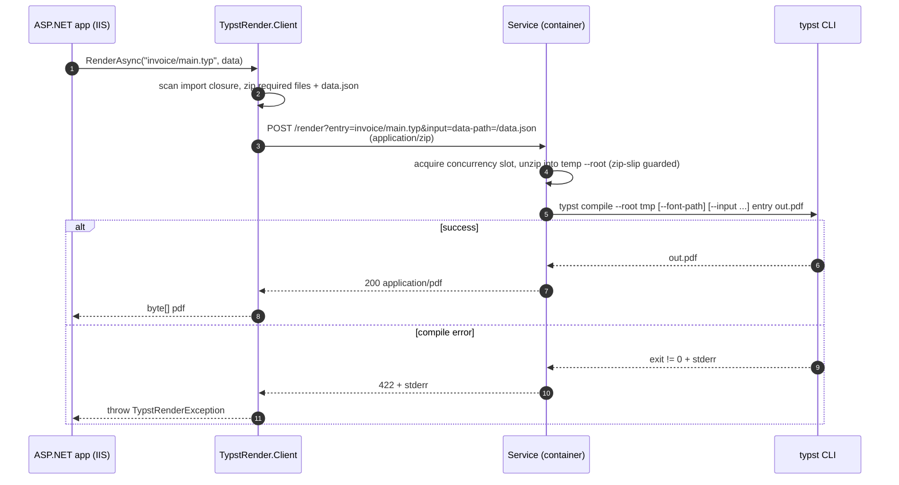

# Typst Render

Render PDFs with [Typst](https://typst.app) from any .NET project — **without**
shipping the Typst binary in every project. Rendering runs in a **container**
(ASP.NET 10 minimal-API service + typst + libre fonts) that your C# app calls over
a private network on a slim **Alpine** base. Projects reference a thin **NuGet client**.

## Architecture



The C# side is the "smart" half (builds the bundle, serializes data); the service is
a thin wrapper around the Typst CLI. The binary and fonts live only in the image —
never in your project or the NuGet.

## Layout

| Path | Role |
| --- | --- |
| `src/TypstRender.Service` | The container: an ASP.NET 10 minimal-API service (`POST /render`) that unzips a bundle, runs `typst`, and returns the PDF. Caps concurrency, shuts down gracefully, logs each render. The binary is installed onto `PATH` by the Dockerfile — not committed. |
| `src/TypstRender.Client` | The NuGet package. `HttpClient`-based SDK (`ITypstRenderClient`) that scans a template's import closure, zips the required files and posts them. |
| `src/TypstRender.Contracts` | Wire-protocol constants shared by client and service. |
| `samples/TypstRender.Sample` | One generic showcase app that renders **any** template under `templates/<name>/` via the client. Drop in a folder to add a template — no code changes. |
| `tests/TypstRender.Client.Tests` | Unit tests for the client's bundling/scanning (no typst needed). |
| `tests/TypstRender.Service.Tests` | In-process integration tests (`WebApplicationFactory`). |

## How it works

The client ships the **templates + images** per request; the container owns the
**Typst engine + a baked-in libre font set** (Liberation, DejaVu). Typst's default
typeface (Libertinus Serif) is embedded in the binary; the system fonts only serve
templates that request a face by name (e.g. Arial via the Liberation drop-in). A request is:

```
POST /render?entry=invoice/main.typ&input=data-path=/data.json
Content-Type: application/zip
<body: the zipped Typst project — the --root tree>
  -> 200 application/pdf
```

- The zip body becomes the Typst `--root` directory. **The bundle root is your
  templates folder**, shipped with its on-disk layout — so absolute imports like
  `#import "/shared/styles.typ"` resolve identically in production and in a local
  `typst compile --root . invoice/main.typ` preview.
- `entry` names the entry `.typ` (root-relative, e.g. `invoice/main.typ`);
  repeatable `input` params map to `typst --input key=value`.
- By convention the client serializes your data object to `data.json` at the bundle
  root and sets `input=data-path=/data.json`, so templates read it with
  `#let data = json(sys.inputs.at("data-path"))`.
- A bundled `fonts/` directory is exposed to Typst via `--font-path` for bespoke typefaces.

The client decides *which* files travel (`BundleMode`): by default (`Auto`) it scans
the entry's import closure — the entry's folder subtree, `fonts/`, and everything
reachable through string-literal `#import`/`#include`/asset reads (`image(...)`,
`json(...)`, ...) — so shared modules ride along while sibling templates stay home.
A reference to a missing file fails client-side with the reference chain, before any
HTTP round-trip. If a template builds an import path dynamically the scanner can't be
sound, so it falls back to shipping the whole folder (`Full` forces that behaviour).
The zipped template bundle is cached and invalidated by file changes; per request only
`data.json` is appended.

### Render flow



Failures return the HTTP status plus a plain-text body: `422` with the Typst stderr
for a compile error, `400` for a bad bundle, `503` when at capacity, `504` on timeout.
The client surfaces these as `TypstRenderException` (`StatusCode` + `Detail`).

The container is intended to sit on a private network reachable only by its caller,
so it does **no authentication** — put a reverse proxy in front if you expose it.

## Using the client

```csharp
services.AddTypstRenderClient(o =>
{
    o.BaseAddress = new Uri("http://typst-render:8080");
    o.TemplateRoot = "path/to/templates"; // becomes the Typst --root
});

// The common case is one line: entry is relative to the template root.
byte[] pdf = await client.RenderAsync("invoice/main.typ", invoiceData);
```

For full control — per-call root, extra `--input` pairs, forcing the whole folder
into the bundle, or templates that don't live on disk — use the request object:

```csharp
byte[] pdf = await client.RenderAsync(new TypstRenderRequest
{
    TemplateRoot = "path/to/templates",   // overrides the configured default
    Entry        = "invoice/main.typ",
    Data         = invoiceData,
    Inputs       = { ["locale"] = "de" }, // extra typst --input pairs
    BundleMode   = BundleMode.Full,       // skip scanning, ship everything
    ExtraFiles   = { ["generated/chart.svg"] = chartBytes }, // render-time assets
    // Files     = ...                    // in-memory bundle (embedded resources, ...)
});
```

`ExtraFiles` is for content generated at render time — charts, barcodes,
signatures. The files ride along with the on-disk template (like `data.json`
does) and the template references them with ordinary paths, e.g.
`image("/generated/chart.svg")`; the bundle scanner knows declared extra paths
and does not expect them on disk.

## Samples

`samples/TypstRender.Sample` is a single, **template-agnostic** console app that
showcases rendering different document kinds through the same client. Each template
lives in its own folder; components shared across templates live in `templates/shared`:

```
samples/TypstRender.Sample/templates/    <- the template root (the Typst --root)
  shared/styles.typ        # colour tokens + helpers (#import "/shared/styles.typ")
  invoice/                 # multi-part template
    main.typ  parties.typ  line-items.typ  footer.typ  data.json
  letter/                  # single-file template + a static image asset
    main.typ  logo.jpg  data.json
  report/                  # embeds an image GENERATED by the C# app at render time
    main.typ  data.json    # (an SVG chart shipped via TypstRenderRequest.ExtraFiles)
  docs/                    # nested, self-documenting pages rendered through the client itself
    intro/main.typ         # how the bundle scanner + GetBundleManifest work
    sample-api/main.typ    # reference for this app's HTTP endpoints
```

The `docs/*` entries are addressed at any depth (`docs/intro`, `docs/sample-api`),
showing that template discovery is recursive — and they double as the sample's own
documentation, produced by the very library they describe.

The app enumerates `templates/<name>/main.typ`, loads that template's `data.json`,
and calls `client.RenderAsync($"{name}/main.typ", data)` — the client does all the
bundling (the letter's `logo.jpg`, the invoice's parts and the shared styles travel
automatically). **Adding a template is a no-code change** — drop a folder. Run it
(service must be reachable, default `http://localhost:8080`):

```bash
docker compose up --build -d                               # or run the service some other way
dotnet run --project samples/TypstRender.Sample            # render every template
dotnet run --project samples/TypstRender.Sample -- invoice # just one
TYPST_SERVICE_URL=http://typst-render:8080 dotnet run --project samples/TypstRender.Sample
```

PDFs are written to `./rendered/<name>.pdf`.

The data is shipped as-is: the app parses each template's `data.json` and the client
serializes it to `/data.json` in the bundle — no per-template C# model required, so a
new template is purely a content change.

The `report` template additionally showcases **render-time generated images**:
when a template's data carries a `chart` series, the app draws an SVG bar chart
in plain C# and ships it via `TypstRenderRequest.ExtraFiles`; the template embeds
it with a regular `image("/generated/chart.svg")` even though that file never
exists on disk.

### Local template previews — no service, no setup

Because the bundle keeps the on-disk layout, the templates folder works directly
with the Typst CLI and editor tooling:

```bash
cd samples/TypstRender.Sample/templates
typst compile --root . letter/main.typ     # renders against the demo data.json
typst watch   --root . invoice/main.typ    # live preview while editing
```

The repo's `.vscode/settings.json` points the [Tinymist](https://github.com/Myriad-Dreamin/tinymist)
extension at the same root, so in-editor previews resolve `/shared/...` imports too.

## Running the container

Pull the pre-built image from the GitHub Container Registry (published by CI on every
push to `main` and on `v*.*.*` release tags):

```bash
docker pull ghcr.io/wetgi/typst-render-service:latest   # or a release tag, e.g. :1.2.3
docker run -p 8080:8080 ghcr.io/wetgi/typst-render-service:latest
```

Tags: `latest` and `edge` track `main`; release tags publish immutable `MAJOR.MINOR.PATCH`
and `MAJOR.MINOR` images; every build is also tagged `sha-<commit>`.

Or build it yourself from source:

```bash
docker build -f src/TypstRender.Service/Dockerfile -t typst-render-service .
docker run -p 8080:8080 typst-render-service
```

The image builds the service, then downloads a pinned `TYPST_VERSION` (build arg) onto
`PATH` alongside the libre fonts. No binary is committed to the repo. The published
images pin the version set in `.github/workflows/publish-container.yml`; a local build
uses the Dockerfile's `ARG TYPST_VERSION` default (override with
`--build-arg TYPST_VERSION=...`).

### Configuration (`Render` section of appsettings, overridable via env, e.g. `Render__MaxConcurrency`)

| Key | Default | Meaning |
| --- | --- | --- |
| `Render:TypstBinaryPath` | `typst` | Typst executable (resolved via `PATH`). |
| `Render:TimeoutSeconds` | `30` | Per-render hard timeout. |
| `Render:MaxUploadBytes` | 20 MB | Max request body (uploaded zip); larger → `413`. |
| `Render:MaxConcurrency` | CPU count (`0` = auto) | Concurrent compilations; excess waits, then `503`. |
| `Render:QueueTimeoutSeconds` | `10` | How long a request waits for a free slot. |
| `Render:ShutdownTimeoutSeconds` | `30` | Graceful drain window for in-flight renders on shutdown. |

## Build & test

```bash
dotnet build TypstRender.slnx
dotnet test tests/TypstRender.Client.Tests/TypstRender.Client.Tests.csproj

# The service tests shell out to `typst`, so put it on PATH first:
./scripts/install-typst.sh && source ./scripts/install-typst.sh.env
dotnet test tests/TypstRender.Service.Tests/TypstRender.Service.Tests.csproj
```
