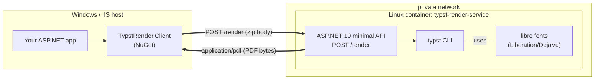
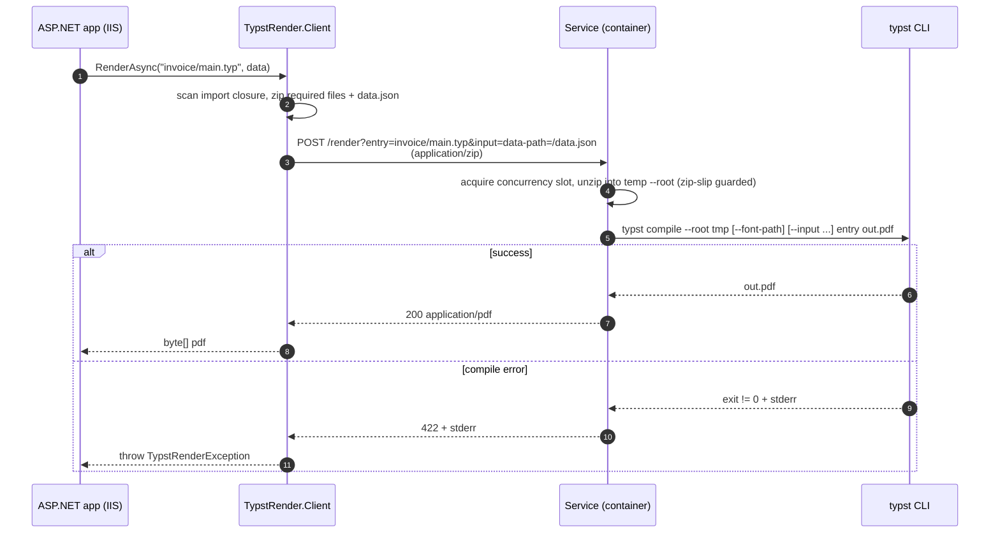

# Typst Render

Render PDFs with [Typst](https://typst.app) from any .NET project — **without**
shipping the Typst binary in every project. Rendering runs in a **container**
(ASP.NET 10 minimal-API service + typst + libre fonts) that your C# app calls over
a private network on a slim **Alpine** base. Projects reference a thin
**[NuGet client](https://www.nuget.org/packages/TypstRender.Client)**.

## Architecture


```mermaid
flowchart LR
    subgraph IIS["Windows / IIS host"]
        App["Your ASP.NET app"]
        NuGet["TypstRender.Client<br/>(NuGet)"]
        App --> NuGet
    end

    subgraph PrivNet["private network"]
        subgraph Ctr["Linux container: typst-render-service"]
            Svc["ASP.NET 10 minimal API<br/>POST /render"]
            Typst["typst CLI"]
            Fonts["libre fonts<br/>(Liberation/DejaVu)"]
            Svc --> Typst
            Typst -.uses.- Fonts
        end
    end

    NuGet == "POST /render (zip body)" ==> Svc
    Svc == "application/pdf (PDF bytes)" ==> NuGet
```

The C# side is the "smart" half (builds the bundle, serializes data); the service is
a thin wrapper around the Typst CLI. The binary and fonts live only in the image —
never in your project or the NuGet.

## Layout

| Path | Role |
| --- | --- |
| `src/TypstRender.Service` | The container: an ASP.NET 10 minimal-API service (`POST /render`, plus `GET /health` and `GET /ready`) that unzips a bundle, runs `typst`, and returns the PDF. Caps concurrency, bounds what an untrusted bundle may unpack to, shuts down gracefully, logs each render. The binary is installed onto `PATH` by the Dockerfile — not committed. |
| [`src/TypstRender.Client`](src/TypstRender.Client/README.md) | The [NuGet package](https://www.nuget.org/packages/TypstRender.Client). `HttpClient`-based SDK (`ITypstRenderClient`) that scans a template's import closure, zips the required files and posts them. See its [package README](src/TypstRender.Client/README.md) for the full client API. |
| `src/TypstRender.Contracts` | Wire-protocol constants shared by client and service. |
| `samples/TypstRender.Sample` | A small ASP.NET app that exposes the client over HTTP and renders **any** template under `templates/<name>/`. Drop in a folder to add a template — no code changes. |
| `tests/TypstRender.Client.Tests` | Unit tests for the client's bundling/scanning (no typst needed). |
| `tests/TypstRender.Service.Tests` | In-process integration tests (`WebApplicationFactory`). |

## How it works

The client ships the **templates + images** per request; the container owns the
**Typst engine + a baked-in libre font set** (Liberation, DejaVu). Typst's default
typeface (Libertinus Serif) is embedded in the binary; the system fonts only serve
templates that request a face by name (e.g. Arial via the Liberation drop-in). A request is:

```
POST /render?entry=invoice/main.typ&input=data-path=/data.json
Content-Type: application/zip
<body: the zipped Typst project — the --root tree>
  -> 200 application/pdf
```

- The zip body becomes the Typst `--root` directory. **The bundle root is your
  templates folder**, shipped with its on-disk layout — so absolute imports like
  `#import "/shared/styles.typ"` resolve identically in production and in a local
  `typst compile --root . invoice/main.typ` preview.
- `entry` names the entry `.typ` (root-relative, e.g. `invoice/main.typ`);
  repeatable `input` params map to `typst --input key=value`.
- By convention the client serializes your data object to `data.json` at the bundle
  root and sets `input=data-path=/data.json`, so templates read it with
  `#let data = json(sys.inputs.at("data-path"))`.
- A bundled `fonts/` directory is exposed to Typst via `--font-path` for bespoke typefaces.

The client decides *which* files travel (`BundleMode`): by default (`Auto`) it scans
the entry's import closure — the entry's folder subtree, `fonts/`, and everything
reachable through string-literal `#import`/`#include`/asset reads (`image(...)`,
`json(...)`, ...) — so shared modules ride along while sibling templates stay home.
A reference to a missing file fails client-side with the reference chain, before any
HTTP round-trip. If a template builds an import path dynamically the scanner can't be
sound, so it falls back to shipping the whole folder (`Full` forces that behaviour).
The zipped template bundle is cached and invalidated by file changes; per request only
`data.json` is appended.

### Render flow


```mermaid
sequenceDiagram
    autonumber
    participant App as ASP.NET app (IIS)
    participant Client as TypstRender.Client
    participant Svc as Service (container)
    participant Typst as typst CLI

    App->>Client: RenderAsync("invoice/main.typ", data)
    Client->>Client: scan import closure, zip required files + data.json
    Client->>Svc: POST /render?entry=invoice/main.typ&input=data-path=/data.json<br/>(application/zip)
    Svc->>Svc: acquire concurrency slot, unzip into temp --root (zip-slip guarded)
    Svc->>Typst: typst compile --root tmp [--font-path] [--input ...] entry out.pdf
    alt success
        Typst-->>Svc: out.pdf
        Svc-->>Client: 200 application/pdf
        Client-->>App: byte[] pdf
    else compile error
        Typst-->>Svc: exit != 0 + stderr
        Svc-->>Client: 422 + stderr
        Client-->>App: throw TypstRenderException
    end
```

Failures return the HTTP status plus a plain-text body: `422` with the Typst stderr
for a compile error, `400` for a bad bundle or a malformed `input` pair, `413` when the
upload is over `MaxUploadBytes`, `503` when at capacity, `504` on timeout, and `500`
when the service could not run Typst at all. The client surfaces all of them as
`TypstRenderException` (`StatusCode`, `Detail`, `Entry`, `RequestUri`), and uses
`StatusCode = 0` for a render that never got a response — an unreachable service, or
its own `Timeout`.

The container is intended to sit on a private network reachable only by its caller,
so it does **no authentication** — put a reverse proxy in front if you expose it.

## Using the client

The client ships on nuget.org as
[**TypstRender.Client**](https://www.nuget.org/packages/TypstRender.Client) — install it
with `dotnet add package TypstRender.Client`. The snippets below cover the common cases;
the [package README](src/TypstRender.Client/README.md) documents the full client API
(streaming, error handling, bundle inspection, and all options).

```csharp
services.AddTypstRenderClient(o =>
{
    // http://localhost:8080 on your machine; the compose/Kubernetes service name
    // (http://typst-render:8080) once both halves run on the same private network.
    o.BaseAddress  = new Uri("http://localhost:8080");
    o.TemplateRoot = Path.Combine(AppContext.BaseDirectory, "templates"); // the Typst --root
});

// The common case is one line: entry is relative to the template root.
byte[] pdf = await client.RenderAsync("invoice/main.typ", invoiceData);

// Or stream it straight out, with no byte[] in the middle:
await client.RenderToAsync("invoice/main.typ", httpResponse.Body, invoiceData);
await client.RenderToFileAsync("invoice/main.typ", "invoice.pdf", invoiceData);
```

`TemplateRoot` is resolved against the process working directory when relative,
which is *not* your project folder under IIS or in a container — hence
`AppContext.BaseDirectory` plus a `CopyToOutputDirectory` rule on the templates.

For full control — per-call root, extra `--input` pairs, forcing the whole folder
into the bundle, or templates that don't live on disk — use the request object:

```csharp
byte[] pdf = await client.RenderAsync(new TypstRenderRequest
{
    TemplateRoot = "path/to/templates",   // overrides the configured default
    Entry        = "invoice/main.typ",
    Data         = invoiceData,
    Inputs       = { ["locale"] = "de" }, // extra typst --input pairs
    BundleMode   = BundleMode.Full,       // skip scanning, ship everything
    ExtraFiles   = { ["generated/chart.svg"] = chartBytes }, // render-time assets
    // Files     = ...                    // in-memory bundle (embedded resources, ...)
});
```

`ExtraFiles` is for content generated at render time — charts, barcodes,
signatures. The files ride along with the on-disk template (like `data.json`
does) and the template references them with an ordinary path relative to the key
you used, e.g. `image("generated/chart.svg")` for the key above; the bundle
scanner knows declared extra paths and does not expect them on disk. A key that
matches a bundled file replaces it, so a template can keep a checked-in
placeholder for local previews.

## Samples

`samples/TypstRender.Sample` is a small, **template-agnostic** ASP.NET app that exposes
the client over HTTP, so you can see rendering, template discovery and bundle inspection
without writing any code. Each template lives in its own folder; components shared
across templates live in `templates/shared`:

```
samples/TypstRender.Sample/templates/    <- the template root (the Typst --root)
  shared/styles.typ        # colour tokens + helpers (#import "/shared/styles.typ")
  invoice/                 # multi-part template
    main.typ  parties.typ  line-items.typ  footer.typ  data.json
  letter/                  # single-file template + a static image asset
    main.typ  logo.jpg  data.json
  report/                  # embeds an image GENERATED by the C# app at render time
    main.typ  data.json    # (an SVG chart shipped via TypstRenderRequest.ExtraFiles)
    generated/chart.svg    # checked-in placeholder, replaced in the uploaded bundle
  docs/                    # nested, self-documenting pages rendered through the client itself
    intro/main.typ         # how the bundle scanner + GetBundleManifest work
    sample-api/main.typ    # reference for this app's HTTP endpoints
```

The `docs/*` entries are addressed at any depth (`docs/intro`, `docs/sample-api`),
showing that template discovery is recursive — and they double as the sample's own
documentation, produced by the very library they describe.

Run it (the service must be reachable, default `http://localhost:8080`):

```bash
docker compose up --build -d                       # start the rendering service
dotnet run --project samples/TypstRender.Sample    # listens on http://localhost:5080
```

| Endpoint | What it does |
| --- | --- |
| `GET /templates` | Every folder under the template root that has a `main.typ`. |
| `GET /render/{template}` | Renders it and returns `application/pdf`. |
| `GET /manifest/{template}` | The files the client *would* upload, and why, without rendering. |
| `GET /scalar` | Interactive API reference (Scalar over the generated OpenAPI document). |

```bash
curl localhost:5080/templates                       # ["docs/intro","docs/sample-api","invoice",...]
curl -o invoice.pdf localhost:5080/render/invoice   # a rendered PDF
curl localhost:5080/manifest/report                 # which files travel, and why
curl -o intro.pdf 'localhost:5080/render/docs%2Fintro'   # nested names are %2F-encoded
```

Point it at a service elsewhere with `TYPST_SERVICE_URL`:

```bash
TYPST_SERVICE_URL=http://typst-render:8080 dotnet run --project samples/TypstRender.Sample
```

**Adding a template is a no-code change** — drop a folder in. The app enumerates
`templates/<name>/main.typ` per request, loads that template's `data.json`, and calls
`client.RenderAsync($"{name}/main.typ", data)`; the client does all the bundling (the
letter's `logo.jpg`, the invoice's parts and the shared styles travel automatically).
The data is shipped as-is — the app parses each `data.json` and the client serializes it
to `/data.json` in the bundle — so no per-template C# model is needed.

The `report` template additionally showcases **render-time generated images**: when a
template's data carries a `chart` series, the app draws an SVG bar chart in plain C# and
ships it via `TypstRenderRequest.ExtraFiles`, replacing the checked-in placeholder that
keeps local previews working.

### Local template previews — no service, no setup

Because the bundle keeps the on-disk layout, the templates folder works directly
with the Typst CLI and editor tooling:

```bash
cd samples/TypstRender.Sample/templates
typst compile --root . letter/main.typ     # renders against the demo data.json
typst watch   --root . invoice/main.typ    # live preview while editing
```

The repo's `.vscode/settings.json` points the [Tinymist](https://github.com/Myriad-Dreamin/tinymist)
extension at the same root, so in-editor previews resolve `/shared/...` imports too.

## Running the container

Pull the pre-built image from the GitHub Container Registry (published by CI on every
push to `main` and on `v*.*.*` release tags):

```bash
docker pull ghcr.io/wetgi/typst-render-service:latest   # or a release tag, e.g. :1.2.3
docker run -p 8080:8080 ghcr.io/wetgi/typst-render-service:latest
curl localhost:8080/ready                               # -> "ok" plus the typst version
```

Tags: `latest` and `edge` track `main`; release tags publish immutable `MAJOR.MINOR.PATCH`
and `MAJOR.MINOR` images; every build is also tagged `sha-<commit>`. Images are built for
`linux/amd64` and `linux/arm64`, so Apple Silicon and arm64 hosts run natively.

Two routes serve orchestration, and they answer different questions:

| Route | Question | Use for |
| --- | --- | --- |
| `GET /health` | Is the process up? Cheap, no dependencies. | liveness / restart decisions |
| `GET /ready` | Can this instance actually render? Runs `typst --version` once and reports it. | readiness / traffic decisions |

The image's own `HEALTHCHECK` probes `/ready`, so a build whose Typst install is missing,
truncated or built for the wrong architecture reports itself unhealthy instead of
accepting traffic and failing every render. The container runs as the base image's
non-root `app` user, and only ever writes into a per-render temp directory — worth
pairing with `--read-only --tmpfs /tmp` (the shipped `docker-compose.yml` mounts `/tmp`
on a sized tmpfs).

Or build it yourself from source:

```bash
docker build -f src/TypstRender.Service/Dockerfile -t typst-render-service .
docker run -p 8080:8080 typst-render-service
```

The image builds the service, then downloads a pinned `TYPST_VERSION` onto `PATH`
alongside the libre fonts. No binary is committed to the repo.

**The Dockerfile's `ARG TYPST_VERSION` is the single source of truth.** `docker compose`,
CI and `scripts/install-typst.sh` all derive from it, so a local build, a published image
and the version the tests ran against cannot drift apart. Bump it in one place; override
a one-off build with `--build-arg TYPST_VERSION=...`, or a one-off publish through the
`publish-container` workflow's manual `typst_version` input.

### Configuration (`Render` section of appsettings, overridable via env, e.g. `Render__MaxConcurrency`)

Every value is validated at startup: a nonsensical limit fails the host with a message
naming the key, rather than turning every render into a puzzling `500` or `504`.

| Key | Default | Meaning |
| --- | --- | --- |
| `Render:TypstBinaryPath` | `typst` | Typst executable (resolved via `PATH`). |
| `Render:TimeoutSeconds` | `30` | Per-render hard timeout. |
| `Render:MaxUploadBytes` | 20 MB | Max request body (uploaded zip); larger → `413`. |
| `Render:MaxExtractedBytes` | 200 MB | Max total size of the *unpacked* bundle. `MaxUploadBytes` caps only the compressed body, so without this a well-formed 20 MB zip of compressible data could fill the disk. |
| `Render:MaxBundleEntries` | `2000` | Max number of files in a bundle. A template closure is tens of files; anything near this is malformed or hostile. |
| `Render:MaxConcurrency` | CPU count (`0` = auto) | Concurrent compilations; excess waits, then `503`. |
| `Render:QueueTimeoutSeconds` | `10` | How long a request waits for a free slot. |
| `Render:ShutdownTimeoutSeconds` | `45` | Graceful drain window for in-flight renders on shutdown. Must be at least `TimeoutSeconds`, or a render started just before SIGTERM is always aborted. |
| `Render:PackagePath` | — | Directory of pre-seeded Typst packages (`--package-path`). See below. |
| `Render:PackageCachePath` | — | Writable cache for downloaded packages (`--package-cache-path`). |

### Typst packages and network egress

A template that imports `@preview/...` makes Typst **download and execute third-party
code at render time**, from `packages.typst.org`. That is convenient on a workstation and
usually not what you want in a service: it makes renders depend on an external host, and
it is the one path by which a template reaches the network.

- **If you don't use packages** (the samples don't), block the container's egress. Nothing
  else needs it.
- **If you do**, pre-seed them into a mounted directory and point `Render:PackagePath` at
  it, or at minimum set `Render:PackageCachePath` to a mounted volume — the default cache
  lives under `$HOME`, so in a container every restart re-downloads and a read-only root
  filesystem fails outright.

## Deploying on Windows / IIS

The architecture diagram puts your app on IIS for a reason: that is the case this split
exists for. Two things follow from it.

**The image is Linux (Alpine).** There is no Windows-container variant — Typst ships musl
and glibc Linux binaries, not a Windows one that this image could use. So the container
runs on Docker Desktop/WSL2 on the same box, or on a separate Linux host, and IIS reaches
it over a private network. That is the whole point of the split: the .NET app stays a
plain IIS deployment, and nothing native is ever installed on the Windows host.

**Your app only needs the NuGet package**, which targets `netstandard2.0` as well as
`net10.0` — so an existing .NET Framework 4.6.2+ application on IIS can consume it
without being ported first.

Two IIS-specific traps worth knowing:

- **`TemplateRoot` and the working directory.** A relative path resolves against the
  process working directory, which under IIS is not your application folder. Use
  `Path.Combine(AppContext.BaseDirectory, "templates")` and a
  `CopyToOutputDirectory="PreserveNewest"` rule on the templates, exactly as the sample
  does — a path that works under `dotnet run` will otherwise fail after deployment.
- **App-pool recycling** discards the client's in-process bundle cache, so the first
  render after a recycle pays for one template scan and zip. That is milliseconds, but it
  is the reason a cold first render looks slower than the rest.

Reach the container either by mapping its port on the host (`http://localhost:8080`) or
through a reverse proxy. The service does **no authentication**, so it must not be
exposed beyond the network its caller sits on.

## Build & test

```bash
# The service tests and `dotnet run` shell out to `typst`, so put it on PATH first.
# The version is read from the Dockerfile, which is the single source of truth.
./scripts/install-typst.sh && source ./scripts/install-typst.sh.env

dotnet build TypstRender.slnx    # builds both client TFMs, the service, and the sample
dotnet test  TypstRender.slnx

# Client tests only — no typst needed, they never leave the process:
dotnet test tests/TypstRender.Client.Tests/TypstRender.Client.Tests.csproj
```

CI (`.github/workflows/ci.yml`) runs exactly this, then packs the client as a release
dry-run. Building the whole solution matters: the client multi-targets
`net10.0;netstandard2.0`, and a test project only ever pulls in the `net10.0` asset — a
netstandard-only break used to stay invisible until `dotnet pack` at release time.

See [CONTRIBUTING.md](CONTRIBUTING.md) for the rest of the setup.
